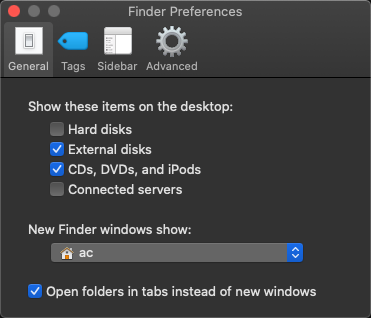
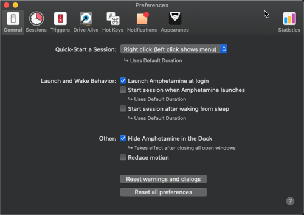
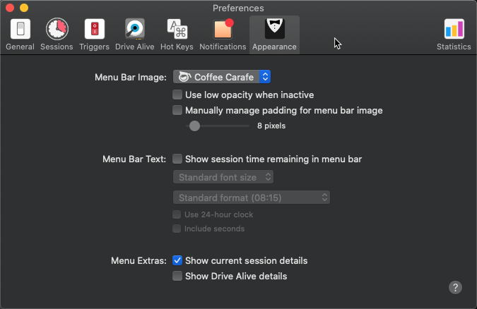
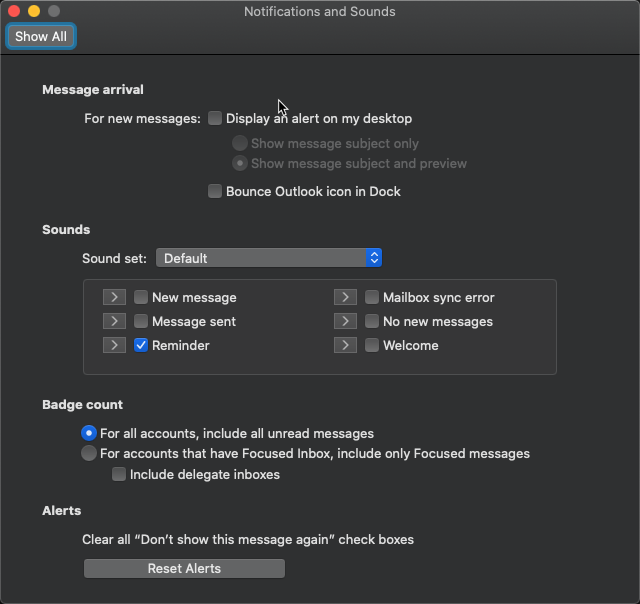
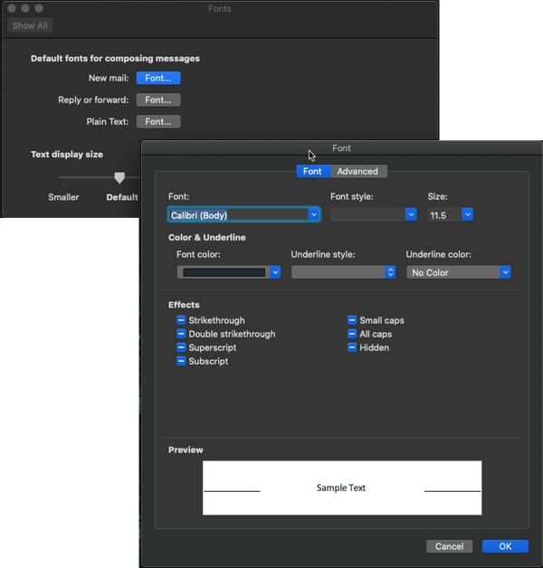
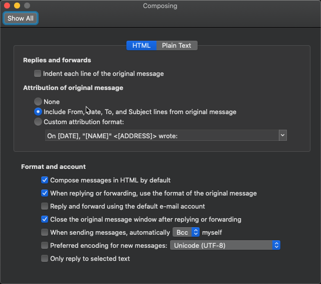
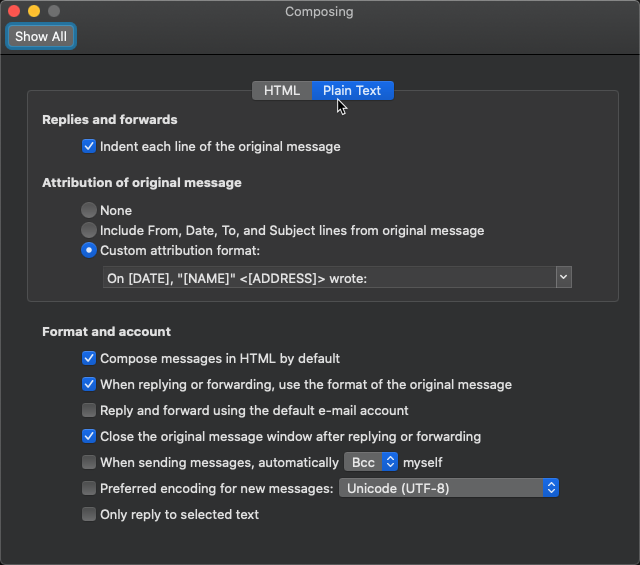
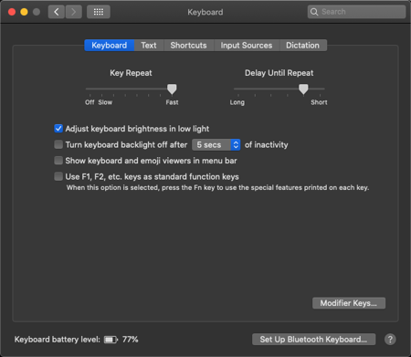
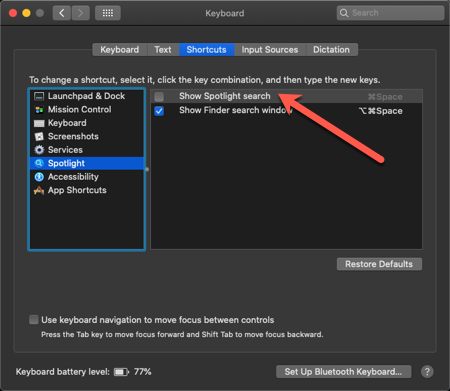
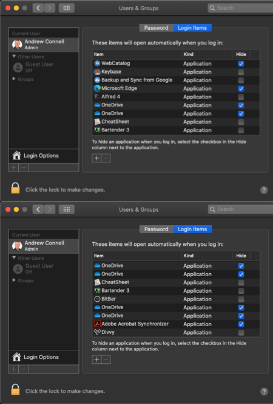

# MacOS Buildout

This repo acts as a log for my buildout of my laptop. As I add stuff or change settings, I log it here so pave & restores can go quickly in the future. Feel free to fork & customize to your liking.

More background info: [BLOG: Rapid Complete Install / Reinstall OS X Like a Champ in Three-ish Hours](http://www.andrewconnell.com/blog/rapid-complete-install-reinstall-os-x-like-a-champ-in-three-ish-hours)

## Before Paving the primary partition, document current config

Do the following before paving the partition. This is to get the way I have things configured in the dock & menu bar back the way I want them.

- Screenshot all installed apps
- MacOS & System
  - have a current Apple TimeMachine backup job finished
  - screenshots of Finder settings

      

      

      

  - screenshot MacOS dock

      

  - screenshot expanded Bartender MacOS Menu Bar

      

- Screenshot OneDrive doclib's (also from MS Teams) sync'd local
- XCOPY to external disk if possible
    > **NOTE:** many of the hidden files & folders are copied as "dot-files"

  - `~/.bash_history`
  - `~/.bash_profile`
  - `~/.gitconfig`
  - `~/.npmrc`
  - `~/.yarnrc`
  - `~/.ssh`
  - `~/.zshrc`
  - `~/Desktop`
  - `~/Downloads`
  - `~/Documents`
  - `~/Pictures`
  - `~/voitanos-workspace`
  - optional
    - `~/_play`
    - `~/Movies`
    - *review other folders in the root*

- Dev
  - Dump list of all repos in `~/repos`
- Adobe Creative Cloud
  - sync all settings in Media Encoder, Photoshop, Prelude, & Premiere Pro
  - export settings for backup
  - Photoshop:
    - export saved actions (*ref **Adobe Creative Cloud/Photoshop***)
  - Premiere:
    - export custom presets (*ref **Adobe Creative Cloud/Premiere Pro***)
- Jump Desktop
  - export list of VMs
- Mac App Store apps
  - refresh list installed MacOS apps: [scripts/macos-install.sh](scripts/macos-install.sh)

      ```shell
      $ mas list
      ```
- Node
  - refresh NPM global package install list: [scripts/npm-global-package-install.sh](scripts/npm-global-package-install.sh)

    ```shell
    $ npm list -g --depth=0
    ```

- Postman
  - export all collections & environments
- Screenflow
  - log batch export settings to **./App Settings/Screenflow**
- Visual Studio Code (**./App Settings/Visual Studio Code**)
  - refresh installed extensions install list: [scripts/vscode-ext-install.sh](scripts/vscode-ext-install.sh)

      ```shell
      $ code --list-extensions
      ```

  - backup snippets & user settings to [app-settings/visual-studio-code](app-settings/visual-studio-code)
    - user settings: `~/Library/Application Support/Code/User`

## Pave partition

1. restart with COMMAND+R
1. when apple logo comes up... delete partition, NOT tiny partition (2nd listed)
1. back up and install MacOS via network

## After pave, install the following

The following installs & configuration should be done to setup automated installs.

### Homebrew & Homebrew Cask

Install [Homebrew](http://brew.sh/) for automated installs & updates.

```shell
curl -L https://raw.githubusercontent.com/andrewconnell/osx-install/master/scripts/homebrew-install.sh | sh
```

### Setup Command Prompt

Install ZSH, Oh My ZSH, iTerm & copy fonts & themes:

```shell
curl -L https://raw.githubusercontent.com/andrewconnell/osx-install/master/scripts/cmdprompt-install.sh | sh
```

- iTerm
  - import settings from `~/Dropbox/My AppSettings/iTerm`
  - apply custom **bullet-train** theme
    - update `~/.zshrc` to specify the theme used: `ZSH_THEME="bullet-train"`
  - update SSH
    - copy the `~/.ssh` keys into the new location
    - reset permissions & add private key to keychain:

      ```shell
      sudo chmod 600 ~/.ssh/id_rsa
      ssh-add -K ~/.ssh/id_rsa
      ```

## Install Apps: `homebrew-install-apps.sh`

```shell
curl -L https://raw.githubusercontent.com/andrewconnell/osx-install/master/scripts/homebrew-install-apps.sh | sh
```

## Configure Core Apps

- login to the following:
  - Chrome
    - *do this first & login to LastPass to get licenses*
  - Edge
  - Google-Drive
  - OneDrive
  - Skype
- Alfred
  - Activate power pack within app settings
  - **Preferences > Advanced**: Syncing - set to `~/Dropbox/My AppSettings/Alfred`
- Amphetamine

    

    

    

- Bartender
  - License & configure (*[use this image for reference](images/macOS-MenuBar.png)*)
- NoSleep
  - Launch & configure (*[use this image for reference](images/NoSleep.png)*)
- Outlook

    

    

    

    

    

    

    

- Steam
  - Launch & login
  - Disable auto login: **Preferences > Interface > [uncheck] Run Steam with my computer starts**
- Sublime Text
  - add license
  - [package control](https://packagecontrol.io/)
  - install packages:
    - BracketHighlighter
    - Git
    - Indent XML
    - Markdown Preview
    - MarkdownEditing
    - Preference Helper
    - Pretty JSON
    - SnippetMaker
    - SublimeCodeIntel
    - Theme-Spacegray
    - TypeScript
    - View In Browser
  - Update preferences from those in [app-settings/sublime](app-settings/sublime)
    - copy to `~/Library/Application Support/Sublime Text`

## Install Mac App Store apps: `macos-install.sh`

Install this stuff from the Apple App Store, then run the next install scripts... while they run, configure these.

```shell
curl -L https://raw.githubusercontent.com/andrewconnell/osx-install/master/scripts/macos-install.sh | sh
```

Configure & login apps:

- Divvy
  - import shortcuts by opening Safari / Firefox & enter the url in [app-settings/divvy-shortcuts.md](app-settings/divvy-shortcuts.md)
- Jump Desktop
  - import the machines from export before pave
- Microsoft Teams
- Parcel
  - *login*
- Slack
- Steam
- restore iStat Settings [app-settings/iStat Menus Settings.ismp](./app-settings/iStat Menus Settings.ismp)

## Install My Personal Apps: `myinstall.sh`

```shell
curl -L https://raw.githubusercontent.com/andrewconnell/osx-install/master/scripts/myinstall.sh | sh
```

- Creative Cloud installs
  - Acrobat DC
  - After Effects 2020
  - Audition 2020
  - Bridge 2020
  - Illustrator 2020
  - Lightroom CC
  - Media Encoder 2020
  - Photoshop 2020
  - Prelude 2020
  - Premiere Pro 2020
- license
  - Screenflow
  - SmartGit
  - SmartSynchronize
  - WebCatalog
- setup
  - Creative-Cloud
    - import settings from Adobe CC, Adobe Media Encoder - import preferences from [app-settings/adobe-creative-suite](app-settings/adobe-creative-suite)
- Visual Studio
  - open & login with O365 account
  - change updates to alpha channel
- Visual Studio Code
  - install [Hack font](http://sourcefoundry.org/hack/)
    - font found in [app-settings](app-settings) as **Hack-*-otf.zip**
  - Launch VS Code
    - from command pallet, find **Shell Command**
      - uninstall & reinstall command in path
      - *repeat the above for VS Code Insiders*
    - install extensions:

        ```shell
        curl -L https://raw.githubusercontent.com/andrewconnell/osx-install/master/scripts/vscode-ext-install.sh | sh
        ```

  - copy snippets & settings:
    - from [app-settings/visual-studio-code](app-settings/visual-studio-code)
    - to `~/Library/Application Support/Code/User`
    - *add license key for WallabyJS*
      - repeat for VSCode Insiders install

### Setup Azure-cli AutoComplete

```shell
$ echo '. <(azure --completion)' >> .zshrc
```

## Manual Installs

- Mac Office

    > Install this from Mac AppStore

  - Outlook configuration
    - General
      - uncheck "group similar folders from different accounts"
      - check "hide on my computer folders"
    - Font
      - color: = navy
      - size: = 11.5
    - Notifications & Sounds: uncheck all except for reminder
    - Reading
      - set to mark as read only when opening in separate window
    - Signature
  - Install Outlook Zoom plugin

      ```shell
      brew cask install zoomus-outlook-plugin
      ```

- [Sophos Home A/V](https://home.sophos.com)
- TechSmith SnagIt
  - get by logging into [TechSmith](http://www.techsmith.com)
  - then launch to license

## Install Node

manage node installs using nvm... this lets me test different versions of node as well as avoid issue with having to use `sudo` when installing packages globally

```shell
curl -L https://raw.githubusercontent.com/andrewconnell/osx-install/master/scripts/nvm-install.sh | sh
```

make sure this is at the very end of `.zshrc`

```shell
$ export NVM_DIR="$HOME/.nvm"
$ . "/usr/local/opt/nvm/nvm.sh"
```

### Install node LTS & stable versions

```shell
curl -L https://raw.githubusercontent.com/andrewconnell/osx-install/master/scripts/node-install.sh | sh
```

now install global packages for each version of node installed:

```shell
curl -L https://raw.githubusercontent.com/andrewconnell/osx-install/master/scripts/npm-install-global-packages.sh | sh
```

## After all Installs, Update Brew, Brew Cask & Purge Installs

```shell
brew doctor
brew update
brew cleanup
brew cask cleanup
```

## Setup git

> might already be done by copying the hidden files over

```shell
git config --global user.name "Andrew Connell"
git config --global user.email <insert primary email>
git config --global credential.helper osxkeychain
# set VSCode as commit message editor & merge tool
git config --global core.editor "code -w"
git config --global merge.tool code
```

## MacOS Tweaks

- Desktop (*change these settings by right-click desktop & pick **Show View Options***)

    

- Menu Bar / Bartender
  - mirror this:

    

- System Preferences
  - Accessibility

      

  - Dock
    - settings: **System Preferences > Dock**

        

    - update dock to the backup image

        

  - General

      

  - Keyboard

      

    - Shortcuts - uncheck options for Spotlight, then manually setup activation keystroke for Alfred to <kbd>CMD</kbd>+<kbd>SPACE</kbd>

        

  - Mission Control

      

  - Internet Accounts

      

  - Printers
    - install / add printers
  - Security > Privacy
    - Activate & enable where necessary
  - Users & Groups / Login Items

      

## Data Restore

- clone select repositories from github => `~/repos`

## Setup TimeMachine Backups

Run first backups.

## Ongoing... HOWTO Keep Things Updated

to keep Homebrew installed things update, do this:

  ```shell
  brew update           # download app updated formulas
  brew outdated         # what's old?
  brew upgrade          # upgrade everything locally
  # list all brew casks installed & their versions
  brew cask outdated
  brew cask upgrade
  # cleanup everything
  brew cleanup
  ```

update MacOS apps:

  ```shell
  mas outdated    # what's old
  mas upgrade     # upgrade everything
  ```

update MacOS: [ref](https://developer.apple.com/legacy/library/documentation/Darwin/Reference/ManPages/man8/softwareupdate.8.html)

  ```shell
  softwareupdate --list
  # install things based on the name returned using
  sudo softwareupdate --install [name listed]
  ```
